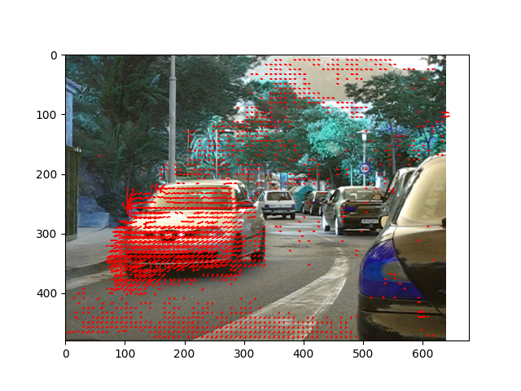

# Optical Flow Computation (Horn-Schunck Method)


## Overview

This is a Python implementation of the Horn-Schunck optical flow computation method. Given an image sequence as input, this program calculates flow vectors (u, v) that represent pixel motion between consecutive frames. The Horn-Schunck method is a classic and widely used approach for estimating optical flow in computer vision.

## Example usage: Test image and corresponding result image

<p align="center">
  
  
</p>

## Features

- Consider two input images of consecutive frames, and compute optical flow.
- Utilizes the Horn-Schunck method for optical flow estimation.
- Regularization constant (alpha) to control the smoothness of the output flow vectors.
- Easily adjustable parameters for customized results.

## Installation

Before running the program, make sure you have Python (>= 3.6) installed on your system. Clone this repository and install the required dependencies:

```bash
git clone https://github.com/chanukaravishan/Optical-flow-Horn-Schunk.git
cd Optical-flow-Horn-Schunk
pip install -r requirements.txt
```

## Usage

To compute optical flow for your image sequences, follow these steps:

1. Prepare your image sequences: Make sure you have consecutive image frames in a directory.

2. Open the `of_hornschunk.py` script and set the `alpha` parameter according to your requirements. The higher the value of `alpha`, the smoother the output flow vectors will be.

3. Run the script by providing the path to your image sequence directory:

```bash
python of_hornschunk.py --input_path /path/to/your/image_sequences --output_path /path/to/save/flow_results
```


## Contributing

Contributions to this project are welcome! Feel free to open issues and submit pull requests to address bugs, add new features, or improve the existing implementation.


## Credits

This optical flow computation program was developed by Chanuka Algama (https://github.com/ChanukaRavishan).

## Acknowledgments

Special thanks to the original authors of the Horn-Schunck method for their valuable research and contribution to the computer vision community.
